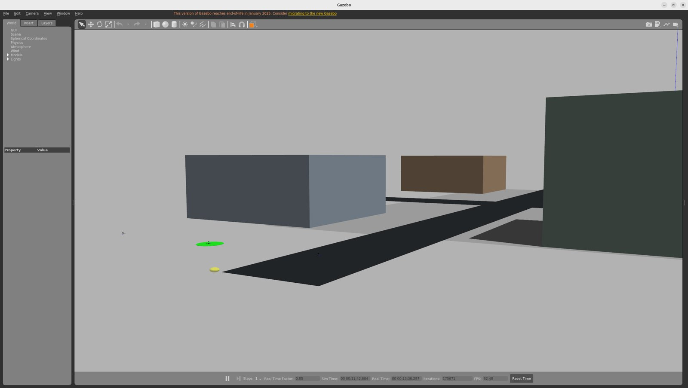
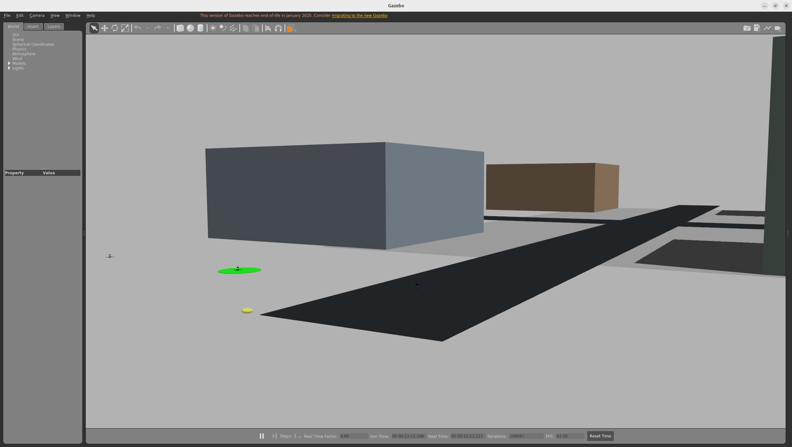

# 仿真图片展示

以下图片直接截取自 `v0.5.11` 园区三机无鸟物理雷达 Gazebo GUI 完整任务。两张均为任务结束后的场景视角；图片只展示实际画面，不用来推断碰撞净空或算法性能。

## 园区道路与建筑

场景包含可见道路、建筑体、起点标志和三架已返回的无人机。园区、住宅、街区三种自建世界的完整飞行指标见 [三世界飞行报告](../reference/gazebo_3d_ros_package_experiment/v0511_real_scale_worlds/OUTDOOR_THREE_WORLD_FLIGHTS_OCT04.json)。

## 三机返航起点

本次可视化重跑已完成投递、返航、降落并解除武装；离线审计记录 3966 个飞行样本均有新鲜的真值、雷达和安全消息，机间最小距离 3.305 m、静态球包络净空 1.876 m、稳定高度最大误差 0.455 m，零意外避障和安全 ERROR。[查看重跑审计](../reference/gazebo_3d_ros_package_experiment/v0511_real_scale_worlds/V0511_GUI_RERUN_OCT04.json)。这些是抽样保守球包络指标，并非连续接触传感器证明。

园区单鸟 ORCA limited 闭环另有[独立报告](../reference/gazebo_3d_ros_package_experiment/v0511_real_scale_worlds/OUTDOOR_CAMPUS_ALLUP_OCT04.json)，上面两张无鸟截图不代表该场景。外部 Baylands 网格只完成导入、许可与空载碰撞核验，尚未接入三机任务，详见 [资产记录](../reference/gazebo_3d_ros_package_experiment/v0511_real_scale_worlds/BAYLANDS_IMPORT_OCT04.md)。
